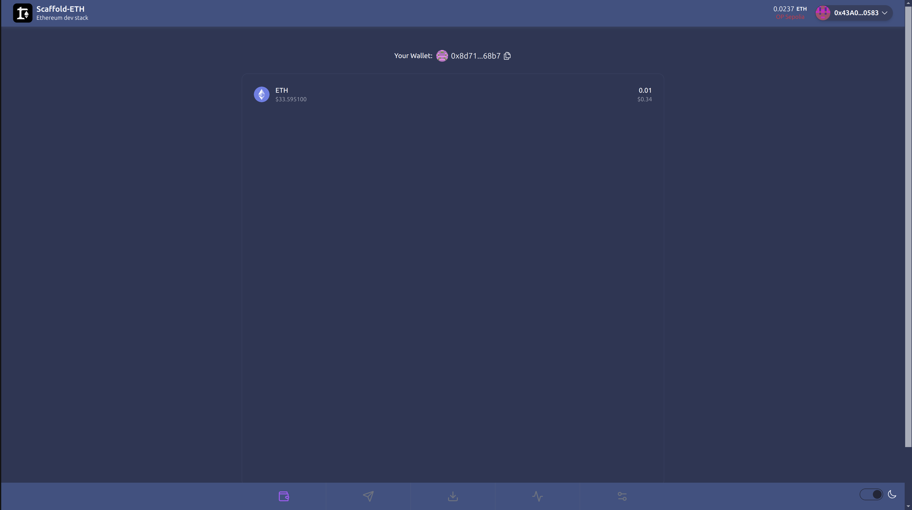
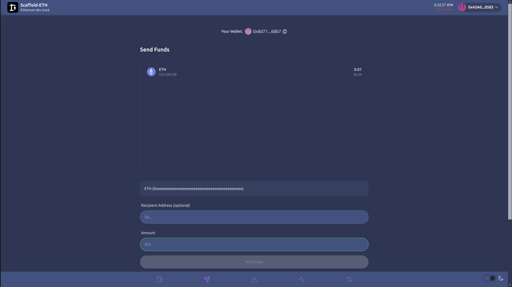
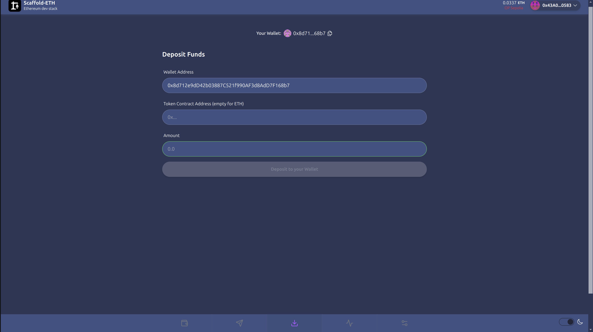
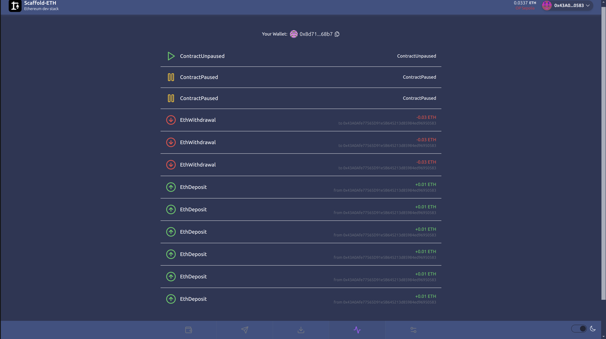
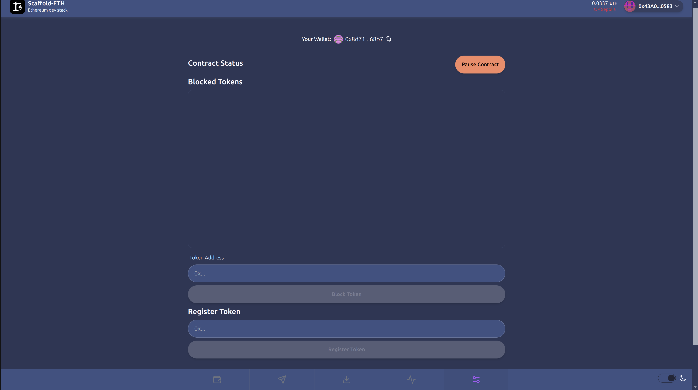

# NadCustodial Wallet
# Frontend

- Connect your wallet and deploy the contract to interact

### Tokens Page
- Displays the tokens held in the wallet and the quantity

### Send Funds Page
- Select a token to transfer it out of your wallet
- An empty recipient address will transfer it to the wallet owner

### Deposit Funds Page
- Specify a NadCustodial wallet to send funds to
- Can send either ETH or ERC20 tokens
- Wallets sent via this page do not need to be registered

### Activity Page
- Shows your wallety activity

### Actions Page
- Allows you to perform admin actions on your wallet
- ERC20 tokens sent via a wallet can be registered here

# Smart Contracts

- Smart contracts are documented using the NatSpec format

### [NadCustodialFactory](./packages/foundry/contracts/NadCustodialFactory.sol)
#### Overview
- Deploy your own custodial wallet
- Look up existing wallets
- One wallet per address
#### Available Functions
- deployContract() returns (address) - Deploy a new custodial wallet
- getUserContract(address user) returns (address) - Get the wallet address for a user
### [NadCustodial](./packages/foundry/contracts/NadCustodial.sol)
#### Overview
- Store ETH and ERC20 tokens safely
- Withdraw funds to the owner address
- Send funds to other addresses
- Register ERC20 tokens for tracking
- Block/unblock tokens from being used
- Pause contract in emergencies
#### Available Functions
- receive() external payable - Receive ETH deposits
- withdraw(uint256 amount) - Withdraw ETH to owner
- send(address recipient, uint256 amount) - Send ETH to an address
- receiveToken(address token_, uint256 amount) - Receive ERC20 tokens
- withdrawToken(address token_, uint256 amount) - Withdraw tokens to owner
- sendToken(address recipient, address token_, uint256 amount) - Send tokens to an address
- registerToken(address token_) - Register a new token
- setTokenBlocked(address token_, bool isBlock) - Block/unblock a token
- isBlockedToken(address token_) returns (bool) - Check if token is blocked
- getTokenBalance(address token_) returns (uint256) - Get token balance
- getTokens() returns (address[] memory) - Get list of registered tokens
- pause() - Pause contract operations
- unpause() - Unpause contract operations

### [TestERC20](./packages/foundry/contracts/TestERC20.sol)
#### Overview
- Simple ERC20 token for testing
- Owner can mint new tokens

## Testing Considerations

### [NadCustodialFactory](./packages/foundry/test/NadCustodialFactory.t.sol)
- Ensures users can deploy their own wallets
- Prevents duplicate wallet deployments
- Validates wallet lookups
- Tests proper event emissions
- Verifies initial wallet state

### [NadCustodial](./packages/foundry/test/NadCustodial.t.sol)
- Tests ETH handling (deposits, withdrawals, sends)
- Validates token operations (deposits, withdrawals, registration)
- Checks security features (pausing, token blocking)
- Verifies balance tracking and updates
- Tests error conditions and access controls
- Confirms event emissions